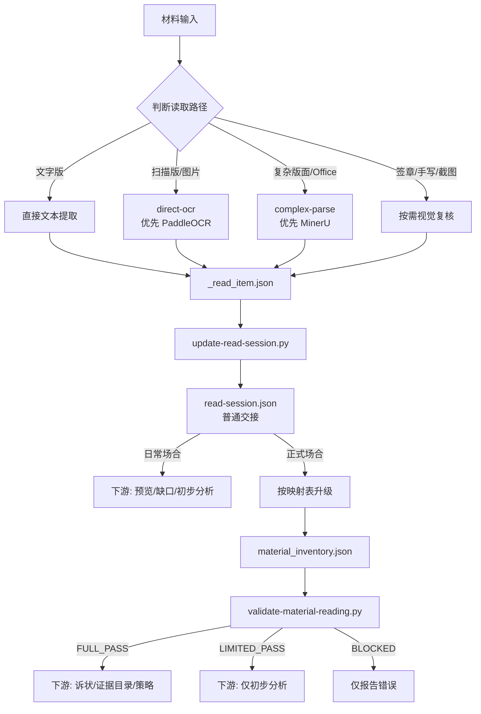

# ocr-router

v1.0.3

法律材料 OCR 统一读取入口与门禁系统。

日常翻材料和正式写诉状，对 OCR 的要求不一样。一个要快，一个要准。现有工具只有两头，没有中间。

跑一遍 OCR 很快，跑完你敢直接用？你不知道它漏了哪页、哪页乱码、表格拆没拆碎。但如果每次翻材料都做完整盘点，又太重了。

这个工具把"读取"和"质量验收"拆成两层：日常读完了给你一个记录文件，写了多少页、第几页有问题、第几页需要人看。到了正式场景，从记录按映射表升级成完整材料清单，补齐复核，校验通过才放行。不重读。

## 流程



## 两个 OCR 引擎

不是技术选型，是材料现实：

- **PaddleOCR**：法律 PDF/图片识别稳定，中文长篇文书日常够用。
- **MinerU**：表格、多层版面、Office 文档、网页的结构化提取比 PaddleOCR 强一截。

手上什么材料都有——扫描版判决书、手机拍借条、财务 Excel、政府网站公告。双引擎自动路由，不用每次想"该用哪个读"。

## 两层模式

| | 普通模式 | 正式模式 |
|---|---|---|
| 产物 | read-session.json | material_inventory.json |
| 校验 | 文件级交接 | validate-material-reading.py |
| 用途 | 预览、初步分析、缺口提示 | 诉状、证据目录、策略评估 |
| 升级 | 可直接升级，不重读 | |

## 安装

```bash
git clone https://github.com/6d7njmvkm9-bit/ocr-router.git
cd ocr-router
cp backends/legal-ocr-engine/config/.env.example backends/legal-ocr-engine/config/.env
# 编辑 .env，填入 PaddleOCR 或 MinerU 的 API 凭证。至少配置一个。
cd backends/legal-ocr-engine
uv run scripts/convert.py checktoken
```

## 使用

日常读取：

```bash
python3 scripts/update-read-session.py --work-dir "工作目录" --source-scope "材料路径" --read-item "_read_item.json"
```

正式门禁：

```bash
python3 scripts/validate-material-reading.py --case-dir "案件目录" --require-scope strategy
```

## 测试

```bash
python3 scripts/test_update_read_session.py       # 25 项
python3 scripts/test_validate_material_reading.py  # 8 项
```

## 许可

MIT。
